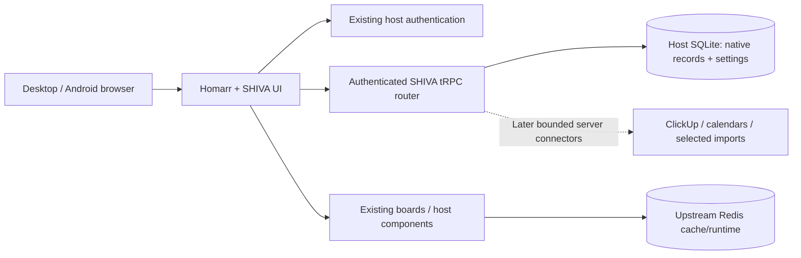

# SHIVA — product and engineering plan

**Prepared:** 5 October 2026

**Product:** single-user personal dashboard for life and the user's own professional work

**Immediate priority:** qualify the working foundation, then add integrations in measured increments.

**Status:** professional product baseline; working foundation with executed acceptance evidence and remaining qualification tracked in [PLAN.md](PLAN.md)

## 1. Product direction

SHIVA should be the place you open to understand your day, choose what matters, and act on a small number of relevant items. It should feel like one polished application even when the information comes from several tools.

Its distinguishing feature is unusually good control over appearance and layout. Customization must improve comfort and usability without putting records, accessibility, or daily reliability at risk.

The application should answer five practical questions:

1. What deserves attention today?
2. What have I committed time to, and what simply has a deadline?
3. How does today's work relate to my goals and routines?
4. What am I researching, planning to buy, or waiting on?
5. Is the information current, and where does it come from?

The product has three layers: a focused Home overview, dedicated modules for useful actions, and personal settings that apply consistently to every module. It is not a second copy of ClickUp, Obsidian, Excel, or an email client.

### Operating assumptions

- One person, one main account. Professional and personal contexts share the application but remain distinguishable.
- Windows laptop with roughly 16 GB RAM; Android access later. The development machine is Linux, not the user's laptop.
- Asia/Kolkata is the default display time zone; INR and Indian number formatting are defaults.
- Local operation first. A sleeping or shut-down laptop makes its server unavailable.
- No required Notion dependency, paid service, public deployment, external account changes, or sensitive sample imports.
- A small maintained fork is acceptable when supported configuration and widgets cannot deliver the product.

### What success looks like

| Area              | Practical success criterion                                                                                                                                     |
| ----------------- | --------------------------------------------------------------------------------------------------------------------------------------------------------------- |
| Daily usefulness  | Home exposes a small set of current priorities, upcoming appointments, deadlines and actionable summaries; every item links to an appropriate action or source. |
| Interface quality | Navigation, cards, tables, forms, empty states and dialogs share one design system on desktop and phone.                                                        |
| Customization     | A user can preview a theme, cancel it, save it, restart the application and recover from a bad setting without losing records.                                  |
| Ownership         | Native records and customization can be exported; source records retain their external IDs and links.                                                           |
| Trust             | Sample data, stale information, provider failures and unconfigured connectors are unmistakable.                                                                 |
| Operation         | Startup, backup, restore and an upstream update are documented and verified against the supported environment.                                                  |

Measure these through acceptance checks and actual use. Do not add analytics infrastructure to measure a single person's dashboard.

## 2. Daily workflows guide the feature set

| Workflow                      | Expected experience                                                                                                                      | Required modules                           |
| ----------------------------- | ---------------------------------------------------------------------------------------------------------------------------------------- | ------------------------------------------ |
| Begin the day                 | Review today's actual commitments and deadlines, choose a few priorities, identify the next action.                                      | Home, SHIVA, Tasks, Calendar               |
| Switch into professional work | Filter to professional tasks and selected client/project contexts while preserving the same navigation and visual language.              | Tasks, context filters, privacy            |
| Plan time                     | See unbooked slots within selected calendars and actual appointments; deliberately schedule a commitment when write support is approved. | Calendar, SHIVA, later explicit writes     |
| Record completion             | Complete a task at its owner, record a routine occurrence or workout session in SHIVA, and distinguish planned from completed work.      | Tasks, routines, Health                    |
| Make a purchase decision      | Capture a need, compare candidates, shortlist, budget and record the purchase without inventing prices or financial transactions.        | Shopping, later Excel summary relationship |
| Find supporting knowledge     | Open a relevant pinned Obsidian note from a goal, project or purchase without maintaining a second notes application.                    | Knowledge, source relationships            |
| Review the week               | Compare intended outcomes, completed native activity and remaining commitments; adjust priorities.                                       | SHIVA, Tasks, Calendar, Health             |
| Recover or move the product   | Restore a backup or export native data and settings with clear version compatibility.                                                    | Settings, backup/restore, exports          |

The first milestone proves navigation, customization and native CRUD. A genuinely useful connected daily overview begins with the second milestone; sample cards alone do not establish daily usefulness.

## 3. Information architecture

```text
Home                 Focused overview; user-selected cards
SHIVA                Vision / Goals / Priorities / Routines / Daily plan / Reviews
Tasks                Personal / Professional / Selected projects and clients
Calendar             Agenda / Day / Week; appointments and deadlines distinguished
Health               Workout plans / Session logs / Progress
Finance              Selected Excel summaries / Import history
Shopping             Needs and purchases / Candidate comparisons / Purchase details
Knowledge            Pinned notes / Selected index / Obsidian links
Inbox                Actionable captures / Selected message references
Settings             Appearance / Layouts / Integrations / Privacy / Data & recovery
```

The SHIVA page name is retained from the brief; its subtitle should explain its purpose, such as “Direction and daily planning.” Settings subpages can grow incrementally. Homarr administration stays available for host management but is not part of the normal personal workflow.

### Shared navigation and interaction rules

- Desktop: persistent side navigation, modest header, clear page title and one primary action where appropriate.
- Phone: navigation drawer, single-column cards, accessible actions and forms. Tables become concise rows or cards with detail views.
- Expanded, icon-only and hidden sidebar choices persist. A visible navigation toggle remains available when hidden.
- Personal/professional labels are text plus a restrained visual cue. Context must not depend on color alone.
- Every module provides intentional loading, empty, validation, error, stale and permission states as relevant.
- Search, filters and sort should be predictable. Preserve useful view preferences, without treating a filter as a change to records.
- Keyboard navigation, visible focus and meaningful accessible names are part of implementation, not a later polish phase.
- Target at least 4.5:1 contrast for normal text and 3:1 for large text and essential interface boundaries. Aim for 44 × 44 CSS-pixel primary touch targets on mobile and verify actual reflow/zoom behavior.
- Never display a control for a future feature as if it already works. Label planned capabilities plainly.

## 4. Feature scope by module

“Required” follows the brief. “Recommended later” is a proposed backlog, not permission to implement everything. “Explore” requires demonstrated usefulness or a feasibility check.

| Module    | Required product direction                                                                                    | Recommended later                                                                                                        | Explore only when useful                                                                                           |
| --------- | ------------------------------------------------------------------------------------------------------------- | ------------------------------------------------------------------------------------------------------------------------ | ------------------------------------------------------------------------------------------------------------------ |
| Home      | Today’s priorities, relevant tasks, appointments and selected summaries; labeled samples initially            | Card-specific context/date settings; upcoming commitments; important stale-source indicator; daily planning shortcut     | Alternative Home profiles for workdays/weekends; a deliberately minimal focus view                                 |
| SHIVA     | Vision, outcomes, goals, priorities, routines, daily plan and reviews                                         | Goal horizons; project/source relationships; routine schedules and occurrence logs; review templates; archived goals     | Time budgets; deliberate focus sessions; goal visualization supported by actual records                            |
| Tasks     | Read-only selected ClickUp tasks with context, client, project, status and due-date filtering                 | Saved views; overdue/due-soon views; source links; later explicit completion, creation or scheduling                     | Task-to-goal suggestions with user confirmation; multi-source tasks only if ownership remains clear                |
| Calendar  | Consolidated agenda; deadlines separate from appointments; source IDs, zones, all-day and recurrence handling | Day/week views; hide/show calendars; source colors with labels; later deliberate time blocking                           | Availability overlays; travel buffers; reminders requiring an approved delivery method                             |
| Health    | Workout plans, session logs, adherence and simple progress                                                    | Exercises, sets/reps/load or duration; planned/skipped/completed states; personal trends and notes                       | Optional measurements or sleep imports after assessing sensitivity and actual provider support                     |
| Finance   | Selected imported summaries from Excel; INR display and privacy                                               | Import provenance, as-of date, category summaries, planned purchase comparison, historical snapshot view                 | Optional multi-currency display only with explicit exchange-rate source/date; detailed accounting remains in Excel |
| Shopping  | Name, category, priority, estimated price/currency, stage, notes, optional source link; durable CRUD          | Separate need and candidate records; requirements; compare products; actual purchase date/amount; receipt/warranty links | Return-window reminders; wish-list capture shortcut; later attachments with quotas and backup support              |
| Knowledge | Configurable Obsidian links, pinned/relevant notes, approved selected index                                   | Tags/title search; note-to-goal/project/purchase references; explicit index refresh                                      | Private local bridge with narrowly scoped capabilities; full-text search only over approved content                |
| Inbox     | Actionable captures and selected messages                                                                     | Native quick capture; source links; process to goal/routine/purchase/reference; triage status                            | Mobile capture shortcut; official selected email import; evaluate WhatsApp separately                              |
| Settings  | Appearance, layouts, privacy, integration states, data portability and recovery                               | Backup status, native data export/import, troubleshooting view, safe mode                                                | Advanced scoped CSS; private access controls; restrained command palette                                           |

### Explicitly outside the product

Team management, organizations, invitations, billing, subscriptions, enterprise permissions, CRM/sales dashboards, a duplicate notes editor, automatic finance reconciliation, general email automation and uncontrolled WhatsApp account automation are excluded. No vector database, queue, agent framework, n8n or companion server is added without a concrete requirement.

## 5. Appearance and layout specification

Appearance is a core product surface with its own acceptance criteria and versioned data format.

### Theme system

| Group            | Controls                                                                                       | Required safeguards                                                                                       |
| ---------------- | ---------------------------------------------------------------------------------------------- | --------------------------------------------------------------------------------------------------------- |
| Mode and palette | Light/dark/system; accent, background, surface, text, secondary text, border and chart palette | Defined system-mode behavior; contrast checks and readable fallback; fixed meaningful status semantics    |
| Typography       | Font family, base size, readable line height and interface density                             | Start with bundled/system fonts; no hidden font-provider dependency; reasonable bounds and reflow         |
| Shape and rhythm | Radius, border strength/visibility, shadows and spacing                                        | Shared tokens, consistent component defaults, usable touch targets                                        |
| Surface roles    | Separate sidebar, header and card surfaces                                                     | Menus, forms, tables and dialogs remain legible in every preset                                           |
| Wallpaper        | Local image selection, positioning, scaling, dimming and overlay                               | File type/size validation, image decoding checks, no executable theme content                             |
| Glass            | Panel opacity and blur, opaque alternative, reduced effects                                    | Contrast protects effective opacity; phone/slow-device fallback; honor reduced motion                     |
| Presets          | Midnight Glass, Graphite, Ivory and named user presets                                         | Defaults retained; clear active/preview state; confirm removal of saved presets                           |
| Portability      | Versioned, validated theme-only JSON export/import                                             | Reject unknown fields or unsupported versions; exclude records and credentials; import into preview first |
| Recovery         | Cancel, restore defaults, safe-mode route and readable fallback                                | Accessible even if persisted appearance is unusable; reset appearance without deleting data               |

Custom palettes apply through design tokens and Mantine theme configuration. Do not paste arbitrary CSS colors into separate modules. Semantic success/warning/error states must remain recognizable and readable after an accent change.

Wallpaper portability is explicit: the initial bounded data-image format can travel inside a validated preset. If wallpapers later move to asset storage, export an independently validated bounded image with the preset or clearly omit it and request reselection after import. Local asset IDs and laptop paths alone are not portable. Imported missing wallpaper falls back to the preset's readable background.

Preset direction:

- **Midnight Glass:** midnight/graphite, restrained blue, optional wallpaper and translucent navigation/cards; readable content surfaces.
- **Graphite:** opaque, calm, high-contrast dark mode for long sessions, low effects and recovery.
- **Ivory:** warm light background, crisp restrained blue, equally considered borders, cards, dialogs and charts.

Gloation informs depth, wallpaper and translucent navigation. Its screenshots also demonstrate why dimming and protected foreground surfaces are necessary. No unlicensed reference CSS or artwork is copied.

### Layout system

First release: show/hide Home cards, reorder with keyboard-accessible buttons, choose supported card widths, persist sidebar choice, save named layouts, preview/cancel/reset and lock after saving. Mobile has a sensible single-column order.

Later: integrate a richer grid where the host supports it, explicit resize/move dialogs, breakpoint-specific layouts, card configuration and layout profiles. Do not force drag-and-drop into every interaction. Avoid competing SHIVA and Homarr board editors: either define their separate scope plainly or reuse the board layout engine when it can support the personal cards safely.

Appearance, layout and records are independently recoverable. A theme import never changes a purchase, goal, routine or connector credential.

## 6. Data ownership and domain model

| Owner                     | Authoritative data                                                                            | What SHIVA may store                                                                      |
| ------------------------- | --------------------------------------------------------------------------------------------- | ----------------------------------------------------------------------------------------- |
| ClickUp                   | Tasks and their provider workflow                                                             | Selected cached summaries, filters, external IDs/links, context and goal relationships    |
| Calendar providers        | Appointments, invitations, recurrence and source calendars                                    | Selected cache with source identifiers and freshness; explicit scheduled relationships    |
| Obsidian                  | Detailed notes and research                                                                   | Approved note links, pinned references, selected title/tag index                          |
| Excel                     | Transactions, financial formulas and workbook results                                         | Explicit imported calculated summaries with schema version and provenance                 |
| Email/messaging providers | Messages and conversations                                                                    | Selected metadata/source references and native capture processing state                   |
| SHIVA                     | Goals, routines, shopping, workout logs, settings/layouts and cross-application relationships | Durable native records, with IDs, timestamps, versioned exports and documented migrations |
| Notion                    | Optional existing source                                                                      | Optional read/import references; no runtime dependency or automatic restructuring         |

### Native objects remain distinct

| Object               | Meaning                                                           | Important relationships                                                                                                                       |
| -------------------- | ----------------------------------------------------------------- | --------------------------------------------------------------------------------------------------------------------------------------------- |
| Outcome/goal         | A result to achieve, with a horizon and optional success criteria | Linked supporting projects, priorities and review entries                                                                                     |
| Supporting project   | A finite body of work supporting an outcome                       | A lightweight native planning object or an explicitly identified external ClickUp project reference; do not duplicate external task ownership |
| Task reference       | A concrete action owned by the task provider                      | Source ID/link, context, selected goal or project relationship                                                                                |
| Routine              | A repeatable behavior definition                                  | Schedule plus separate occurrences: completed, skipped or pending                                                                             |
| Time commitment      | An appointment or deliberately reserved time                      | Provider event reference; separate from a task's due date                                                                                     |
| Workout plan/session | Intended exercise versus actual activity                          | Session outcomes, exercises and optional goal/routine link                                                                                    |
| Shopping need        | What to buy and why                                               | Requirements, stage, estimated budget, candidates and eventual purchase                                                                       |
| Candidate product    | One possible solution to a shopping need                          | Source URL, researched attributes, manually entered dated price, pros/cons                                                                    |
| Capture              | An item to process                                                | Native text or selected source reference, triage state and explicit destination relationship                                                  |
| Source reference     | Stable external identity                                          | Provider, account/source scope, external ID, canonical link and last-seen metadata                                                            |

Start Shopping with the brief's flat record. Add candidate comparisons as a separate later schema extension, rather than making the first form unwieldy.

Initial Shopping field contract: name is required, trimmed and 1–120 characters; category is required, freely entered and 1–60 characters; priority is low/medium/high. Estimated price is optional and nullable, nonnegative, explicitly estimated, with currency stored separately and validated precision. The initial currency choices are INR, USD, EUR and GBP; INR is the default. Stage is one of the five requested values. Notes are optional with a 5,000-character limit; source URL is optional, at most 2,048 characters and HTTP(S) without embedded credentials. Editing preserves the stable ID and created timestamp.

Health trends use recorded activity. They do not generate medical scores or diagnoses, and a planned workout never implies a completed session.

### Persistence conventions

- Reuse Homarr's database, authentication and migration system. SQLite is the primary supported personal installation; PostgreSQL remains an upstream-compatible path with its own verification requirement.
- User-owned native records use stable IDs, created/updated timestamps and ownership checks. Settings are a versioned validated document.
- Currency is explicit on every monetary value. Use integer minor units or a documented decimal representation for future monetary calculations; do not introduce floating-point financial accounting in SHIVA.
- Never aggregate unrelated currencies without conversion. Unknown prices remain unknown, not zero; estimates are labeled.
- Display times in Asia/Kolkata by default. Store actual instants consistently, preserve provider time zones, and represent all-day dates without converting them into midnight UTC appointments.
- Routine schedules and logs are separate. Editing a plan must not rewrite historical completion.
- Cache updates use provider/account/source IDs and upserts. Refreshing does not generate duplicate records.
- Use a unique source identity that includes owner, connector, source scope, resource type and external ID. Only a complete successful refresh can establish that cached source items were removed; partial refresh failures never erase the last good snapshot.
- Native exports, themes and credentials are separate. Backup bundles can include secrets only with explicit handling and private storage.
- Foundation settings include a schema version, visible corruption reporting and revision-based concurrency protection. Future schema versions need explicit migration; a safe fallback must not silently erase unreadable stored preferences.

### Finance/Shopping boundary

An estimated purchase cost is a planning value. Marking a purchase as bought records the Shopping workflow; it does not create a transaction in Excel or recalculate the workbook. Later budget comparisons use imported summaries with an as-of date, and any Excel write path requires separate authorization.

## 7. Architecture decision and extension strategy

**Selected base:** Homarr stable `v2.1.2`, commit `473b6cb7c46a147886c41a9b1fabe36d10b6b854`, Apache-2.0.

Actual source inspection confirmed Next.js, Mantine, Auth.js, authenticated tRPC, Drizzle SQLite/PostgreSQL migrations, persistent responsive boards, branding and restricted Custom JSX v2 widgets with server-side request execution. The default repository branch is development; use the pinned release, not an unqualified default-branch checkout.

This is a small documented fork of a working application. It retains the host rather than introducing an admin template or rebuilding its infrastructure.



### Extension order

1. Use existing configuration, branding, navigation/boards and supported theme controls where they meet requirements.
2. Use supported custom widgets for bounded summaries or server-side provider requests where appropriate.
3. Add isolated native SHIVA UI/API/domain files when records and app-wide behavior need more than widget options.
4. Introduce a companion component only for a demonstrated boundary, such as an approved laptop-local Obsidian bridge that cannot run in the host.

Temporary widget inputs are not native durable storage. A Shopping database behind a companion service would add another process, storage system and authentication boundary while global appearance still needs host integration. The small fork is therefore the current preferred route.

### Migration and asset strategy before real use

SHIVA migrations now run through Homarr's custom-migration hook using a separate `__shiva_migrations` journal in the same authoritative database. Upstream journals remain unchanged. A populated SQLite migration/reopen test exercises an additional host migration without collisions. Preserve already-applied SQL, ordering and hashes; qualify every actual upstream upgrade on a restored copy. See [MIGRATIONS.md](MIGRATIONS.md) for generation and upgrade conventions.

Wallpapers are validated, optimized images in authenticated owner-scoped storage, referenced by small local URLs in settings/presets. Ordinary privacy/layout saves contain no wallpaper bytes. Image bytes appear only in explicit portable theme export/import. Database and wallpaper files are backed up together; Homarr's database-only export requires the separate asset directory for a full restore.

### Change boundaries

- UI and original styles: `apps/nextjs/src/shiva/`.
- Route entry: `/shiva`; a narrow root-navigation hook makes it the personal landing page.
- Shared schema: `packages/validation/src/shiva.ts`.
- Authenticated operations: one `packages/api/src/router/shiva.ts`, registered through the host router.
- Records: dedicated SHIVA tables exported through host schema registries, with migrations for supported drivers.
- Startup: cross-platform wrapper and a localhost Redis compose file.
- Limited service binding hooks; keep the upstream host structure and license notices.

Homarr remains relatively large and requires Redis. This is a real cost of reuse. Dashy `4.7.0` and Homepage `v2.4.0` were checked briefly; neither removed the need for native storage/CRUD and product-wide customization. Revisit the decision only if measured resource use, an unsupported extension boundary or update conflicts become a concrete blocker.

## 8. Connector contract

Every connector has an explicit scope and a single lifecycle contract:

| State                  | Meaning                                                                          |
| ---------------------- | -------------------------------------------------------------------------------- |
| Not configured         | No usable configuration exists.                                                  |
| Configured, unverified | Configuration was saved, but verification has not succeeded.                     |
| Connected              | A real verification succeeded and current data meets its freshness policy.       |
| Syncing                | A bounded refresh is in progress.                                                |
| Stale/offline          | Last good data exists, but refresh is overdue or the provider cannot be reached. |
| Failed                 | The connector could not complete its operation; explain the recoverable cause.   |
| Demo data              | Information is synthetic; it must never masquerade as a verified connection.     |

Show last attempt, last successful refresh, source identity and a sanitized actionable error. Preserve the last good cache when a refresh fails. Freshness thresholds depend on the source and user configuration; there is no universal “connected forever” flag.

### Shared implementation rules

- Credentials remain server-side, encrypted using host conventions, and excluded from client responses and exports.
- Missing credentials never prevent startup. Do not infer separate-application authentication from connected ChatGPT accounts.
- Verify with the smallest suitable supported request before showing Connected.
- Distinguish the application's read-only behavior from the credential's actual permissions. For example, a broad personal API token may support writes even when SHIVA only calls read endpoints; disclose this and use narrower credentials when the provider supports them.
- Use bounded pagination, timeouts, sensible cache expiry and explicit scope selection.
- Serve available local records and clearly marked cache without waiting for a provider during page rendering; refresh sources independently.
- Retry transient failures with limits and backoff; honor provider rate limits and Retry-After. Authentication failures require re-verification rather than endless retries.
- Avoid duplicate concurrent refreshes in the host process. Use existing scheduling/cache facilities before considering new infrastructure.
- Read requests never create, complete, schedule or delete source records.
- External titles, descriptions and messages are untrusted content. Escape/render safely and never execute them as instructions.
- Later writes require a deliberate UI action, confirmation where appropriate, supported API semantics and a visible result. Reconcile uncertain outcomes before retrying a create operation.

### Incremental connector plan

| Connector | Initial scope                                    | Feasibility and implementation requirements                                                                                                                                                                       |
| --------- | ------------------------------------------------ | ----------------------------------------------------------------------------------------------------------------------------------------------------------------------------------------------------------------- |
| ClickUp   | Selected read-only tasks                         | Verify official authentication/scopes, selected lists/spaces, pagination, status mapping, due-time semantics, context labels and canonical links. Test revoked access and rate limits.                            |
| Calendar  | Selected feeds or supported provider APIs        | Choose provider after actual need is known. Handle feed privacy, all-day dates, event/source IDs, recurring instances/exceptions, time zones and duplicate sources. Write/invitation support is separate.         |
| Excel     | Explicit calculated-result CSV/JSON summary      | Publish an example schema and export instructions. Validate size, dates, units/currencies, required fields and duplicate imports. Preview before replacing summaries. Reading XLSX does not recalculate formulas. |
| Obsidian  | Configurable vault/note links and selected index | Explain URI behavior on Windows/Android. A server cannot read laptop files automatically. Any bridge is private, authenticated and restricted to an approved vault/index scope.                                   |
| Email     | Selected actionable metadata                     | Choose official least-privilege access, explicit source selection, revocation and minimal retention. No send/delete/archive/reply in read scope.                                                                  |
| WhatsApp  | Separately evaluated capture path                | Verify current official support for the actual account type. If personal-account access is unsupported, prefer selective capture/shortcut. No unofficial session scraping by default.                             |
| Notion    | Optional read/import                             | Preserve IDs and provenance; explicit scope and preview. No automatic migration, restructuring or deletion.                                                                                                       |

## 9. Reliability, security and access

### Local-first operation

Use one host application plus its required Redis service. Keep Next.js, Redis and the embedded WebSocket server on loopback for source startup. No public tunnel, automatic port exposure or remote deployment.

Native Shopping/settings should remain usable when provider integrations are offline. SHIVA must show its own local save failure honestly. A browser offline cache can be considered later, but offline writes and conflict resolution are not promised by installing a PWA.

### Windows delivery options

| Option                                             | Recommended use                                  | Tradeoff                                                                                                |
| -------------------------------------------------- | ------------------------------------------------ | ------------------------------------------------------------------------------------------------------- |
| Source checkout + Node + localhost Redis in Docker | Initial development and customization with Codex | Native dependency/toolchain care; Docker Desktop footprint; cross-platform command wrappers required    |
| Built local server from that checkout              | Daily use after build acceptance                 | Quicker steady operation than a dev server; rebuild on updates; laptop must remain awake                |
| Locally built modified Homarr container            | Evaluate after the foundation stabilizes         | More repeatable runtime packaging, but Docker/WSL resource cost and image-build verification remain     |
| Private always-on host                             | Consider only for dependable phone access        | Requires explicit approval, secure access/HTTPS, backup and maintenance; possible hardware/service cost |

Current source requires Node >=24.18.0 and the upstream pinned pnpm toolchain. Inspect the actual Windows versions and errors when installation occurs. A wrapper handles the upstream POSIX-only build script. No Windows execution is claimed from Linux tests.

### Android and remote access gate

Before enabling another device, decide whether occasional local access or always-on access is required. Explain laptop sleep/offline behavior, use authenticated private access with HTTPS where applicable, and inspect access rules. A VPN/private network is a candidate, not automatic permission to install or expose it. Browser/PWA usability comes before a separate native Android app.

### Safeguards

- Reuse host authentication, sessions and CSRF protections; authorize every native operation server-side.
- Keep secrets out of tracked files, browser bundles, screenshots, logs, theme files and ordinary record exports.
- Confirm native deletion; later consider undo/trash only if useful enough to maintain.
- Privacy masks financial figures and sensitive labels in shared views. Deliberately opening a record may reveal it; it is a presentation setting, not authentication or encryption.
- Privacy verification includes chart axes/tooltips, totals, search results and dialogs. Deliberate reveal must be visibly indicated and temporary where practical; never expose data through a tooltip while its visible label is masked.
- Sanitize URLs, imports and connector content; prevent unrestricted filesystem and SSRF access.
- Document data deletion cascades, particularly deletion of the local account.
- Do not adopt downloaded CSS/JavaScript as a theme. Scoped CSS can be a separately reviewed advanced feature.

### Backup, portability and recovery

At minimum, back up SQLite consistently, local secret configuration, required media and version metadata to private storage. Treat Redis as disposable cache. Stop writes or use a supported SQLite backup operation; do not copy only the main database file while a live WAL contains writes.

Provide a tested restore drill before declaring daily-use readiness. A database backup is different from a portable native-record export and a theme preset export. Restoring with a different encryption key may make host connector secrets unreadable; preserve configuration privately.

Later scheduled backups should report their last successful outcome. Export/import needs version validation, preview, duplicate handling and failure rollback. Do not silently merge arbitrary backups into live records.

## 10. Performance and maintainability

Professional performance is a release requirement. The [performance specification](PERFORMANCE.md) defines production measurement conditions, desktop/mobile budgets, data volumes, resource limits, soak checks and regression gates. The [verification report](VERIFICATION.md) records executed lab measurements and remaining qualification; targets are not evidence until measured.

Key targets: visible feedback within 100 ms, p95 warm desktop navigation within 500 ms, p95 ordinary durable native saves within 500 ms, cold-load LCP <=2.5 seconds, CLS <=0.1 and interaction latency <=200 ms. Measure actual Windows production use; local desktop timings do not establish future Android access performance.

Keep Home focused on about 5–8 cards. Paginate larger lists, query summaries directly, load optional heavy modules on demand, deduplicate refreshes and reduce glass effects on mobile. Keep ordinary settings lightweight and move wallpaper bytes out of routine privacy/layout saves before daily-use performance sign-off.

Measure app/services, browser and Docker/WSL overhead separately on the 16 GB laptop. Target <=2 GB for application services under the supported interactive workload, investigate memory growth and test an eight-hour representative session. If the chosen host fails the user-facing budgets, resolve the bottleneck or revisit the architecture before expanding scope.

Upstream updates follow a documented process: backup, create an isolated update branch, inspect stable release notes and changed extension seams, apply migrations, run focused checks, verify browsers, and keep a restore path. Do not automatically move production to a development branch or latest floating image.

## 11. Delivery roadmap and phase gates

The phases describe dependency order, not a commitment to implement every backlog item. Reliable estimates should follow complete foundation verification and real provider-scope decisions.

| Phase                                               | Deliverable                                                                                                                                              | Definition of done / exit gate                                                                                                                       |
| --------------------------------------------------- | -------------------------------------------------------------------------------------------------------------------------------------------------------- | ---------------------------------------------------------------------------------------------------------------------------------------------------- |
| 0 — Plan and feasibility                            | Product plan, pinned-source decision, risk assessment and baseline scope                                                                                 | Relevant source/license/visual review recorded; assumptions and external boundaries explicit; no unfinished work presented as complete               |
| 1 — Working foundation                              | Runnable Homarr fork; SHIVA navigation; sample Home; 3 themes; durable presets/layouts/privacy; native Shopping; honest planned states; Windows guidance | Production build, relevant type/lint/tests and browser acceptance pass or documented blockers are resolved; restart/restore checks prove persistence |
| 2 — Connected daily overview                        | Read-only selected ClickUp tasks and calendar agenda                                                                                                     | Verified auth, clear scope/source/freshness, retries/deduplication, context filters, zone/recurrence checks; no account writes from rendering        |
| 3 — Native planning and health                      | Goals/outcomes, routines/occurrences, daily plan/reviews, workout plans/session logs                                                                     | Object meanings remain distinct; logs are durable; planned/completed states correct; useful end-to-end daily/weekly workflow                         |
| 4 — Finance and knowledge                           | Calculated Excel summary imports, provenance/privacy, Obsidian links/selected index                                                                      | Invalid imports rejected; preview and duplicate policy tested; no formula/macro assumptions; no unrestricted vault access                            |
| 5 — Actionable capture and approved actions         | Native Inbox plus selected email; evaluate WhatsApp; deliberate provider writes as separately approved                                                   | Least privilege, explicit scope and revocation; untrusted content handling; safe uncertain-outcome retries; no automatic messages                    |
| 6 — Advanced personalization and mobile reliability | Richer layouts/search, justified reminders, private Android access or PWA improvements                                                                   | Measured user need; safe access setup approved; offline/conflict behavior explicit; restore/update/reduced-effects regressions tested                |

### First milestone: concrete acceptance checklist

| Area                | Acceptance evidence required                                                                                                                              |
| ------------------- | --------------------------------------------------------------------------------------------------------------------------------------------------------- |
| Installation        | Clean locked install; compatible Node/pnpm verified; no opaque installers; localhost services; onboarding/login works                                     |
| Host reuse          | Upstream board/admin functionality accessible; narrow SHIVA changes documented; license preserved                                                         |
| Navigation          | Every requested top-level destination reachable; current page indication; collapsed/hidden/sidebar recovery; mobile drawer and keyboard use               |
| Home                | Sample data unmistakably labeled; no real confidential records; real Shopping summary distinguished; no decorative invented metrics                       |
| Appearance          | All 3 presets, mode switching, token controls, wallpaper, glass/opaque/reduced-effects behavior; live preview/cancel/save; dialogs and menus readable     |
| Persistence         | Save themes, custom presets, layout and Shopping; reload and restart processes; verify exact records/preferences survive                                  |
| Themes              | Valid export/import round trip; malformed/extra-field/oversized/unsupported inputs rejected; credentials absent; reset/safe mode leave records intact     |
| Layout              | Hide/show/reorder/width controls and named presets; no drag-only interaction; cancel preview; save and lock; sensible mobile order                        |
| Shopping            | Empty state, create/edit/delete, input bounds, stage/category/priority filters, unknown price, INR formatting, safe links, confirmation and failure state |
| Privacy             | Hide sensitive content across Home/Shopping and later financial views; state persists; data remains unchanged                                             |
| Integration honesty | Unconfigured/planned states; no fabricated verification or last refresh; no provider requests/writes from samples                                         |
| Quality             | Focused auth/input/persistence checks; relevant type/lint; production build; real desktop and narrow browser interaction; no console/network regressions  |
| Maintenance         | Setup/start/stop commands, actual data location, backup/restore drill, known failures and upstream update process                                         |

### Recommended implementation sequence within phase 1

1. Establish a runnable upstream baseline and record resource/runtime constraints.
2. Add shared schemas and durable host storage; verify ownership and restart persistence.
3. Add the isolated shell, navigation and shared design tokens.
4. Build Appearance first so native modules use the same design system from the start.
5. Build Shopping CRUD and all associated states.
6. Add labeled Home samples, layout preferences and planned module pages.
7. Test keyboard/mobile interactions, theme recovery and data independence.
8. Run production checks, restore drill and refine Windows instructions using actual results.

No new phase begins merely because its UI is attractive. Each phase ends with reviewable behavior and evidence.

### Candidate backlog: value and effort

These relative sizes are planning aids, not estimates of elapsed time. “Small” is a narrow addition using established components; “medium” crosses UI and persistence; “large” introduces provider, access or conflict complexity.

| Candidate                       | Likely value                                          | Relative size | Prerequisite / main cost                                                                                  |
| ------------------------------- | ----------------------------------------------------- | ------------- | --------------------------------------------------------------------------------------------------------- |
| Saved task views                | Faster switching between personal/professional work   | Small–medium  | Verified ClickUp fields and stable filter model                                                           |
| Native quick capture            | Less friction recording a purchase or item to process | Medium        | Defined destinations, durable capture record and mobile form                                              |
| Daily/weekly review templates   | Better continuity between intentions and action       | Medium        | Native plans, routines and actual logs; avoid fabricated achievement scores                               |
| Shopping candidate comparison   | Stronger purchase decisions                           | Medium        | Separate candidates/requirements schema and usable comparison layout                                      |
| Receipt and warranty tracking   | Useful follow-up after purchasing                     | Medium        | Validated attachment storage, quotas, sensitive-data handling and backups                                 |
| Command palette / global search | Quicker navigation and retrieval                      | Medium–large  | Enough real records, permission-aware source indexes, explicit search scope                               |
| Goal and health trends          | Useful reflection over time                           | Medium        | Enough trustworthy history and clearly defined metrics                                                    |
| Reminders                       | Helps act at the right time                           | Medium–large  | Chosen delivery method, approval for outbound messages where needed, deduplication and timezone semantics |
| Private Android access          | Makes the product useful away from the desk           | Large         | Approved access/HTTPS/session setup and always-on versus sleeping-host decision                           |
| Offline mobile writes           | Useful when host access is intermittent               | Large         | Local storage, conflict resolution, replay/idempotency, sensitive-data retention; defer                   |
| Advanced scoped CSS             | More individual styling freedom                       | Medium–large  | Isolation, recovery and compatibility rules; token controls should cover most needs first                 |

Prioritize a candidate when it removes a repeated real friction. Avoid committing to a feature simply because it appears on this list.

## 12. Validation strategy

Use a small set of meaningful checks rather than a large suite mirroring implementation:

- **Schemas/security:** invalid inputs, unsupported URLs, oversized themes, unauthenticated calls, cross-user access and credential redaction.
- **Persistence:** actual SQLite migration, CRUD, process/database reopen, settings round trip; verify migrations preserve existing host records.
- **Functional browser:** create/edit/confirm-delete Shopping; filter/search; presets and custom settings; theme import/reset/safe mode; layout cancel/save; navigation and privacy.
- **Accessibility/visual:** keyboard path, focus, contrast, 200% zoom/reflow, readable dialogs/menus/tables, narrow viewport, reduced motion/effects.
- **Connections later:** successful and failed verification, revocation, stale cache, duplicate refresh, pagination/rate limit, calendar recurrence/all-day/time-zone edge cases, no implicit writes.
- **Operations:** clean startup, production build, restart, backup/restore, version compatibility and update rehearsal.
- **Performance:** production cold/warm load and interaction traces, representative/larger synthetic datasets, all theme effects, resource attribution, long-session stability and comparable regression checks as defined in [PERFORMANCE.md](PERFORMANCE.md).

Homarr's build configuration skips TypeScript errors, so a successful build alone is insufficient. Run typechecking separately. Record upstream failures independently from SHIVA regressions, without treating either as a successful acceptance gate.

## 13. Risks and decisions that need care

| Risk                                            | Impact                                       | Mitigation / decision trigger                                                                                        |
| ----------------------------------------------- | -------------------------------------------- | -------------------------------------------------------------------------------------------------------------------- |
| Host size and Redis footprint                   | Laptop responsiveness or maintenance burden  | Measure actual production resource use early; do not add servers; revisit base only for measured blockers            |
| Fork drift                                      | Repeated update conflicts                    | Isolated feature files, narrow hooks, stable release pins, seam checklist and backup/update rehearsal                |
| Fork migration numbering collides with upstream | Upgrade breaks or corrupts migration history | Define append-only handling; test from an already-populated fork database; never rewrite applied migrations          |
| Attractive but incomplete UI                    | False sense of progress                      | Workflow-based phase gates, actual browser tests and honest future states                                            |
| Theme breaks readability                        | Daily access impaired                        | Contrast enforcement, constrained controls, opaque preset, safe mode and records-independent reset                   |
| Duplicate authority                             | Conflicting tasks/notes/finance              | Ownership matrix, source IDs, explicit native models and narrow caches                                               |
| Provider permissions or API limits              | Connector cannot meet expectations           | Small read-only proof first; actual official capability/scopes checked before writes                                 |
| Windows native dependencies                     | Installation failure                         | Compatible toolchain, lockfile, cross-platform wrapper, actual error diagnosis and a container option when justified |
| Local-host availability                         | Phone access fails when laptop sleeps        | Explicit local tradeoff; separately approve secure always-on access if needed                                        |
| Multi-tab/device settings races                 | Lost preference updates                      | Version/concurrency checks before wider-device use; avoid uncontrolled optimistic overwrites                         |
| Sensitive data exposure                         | Professional/personal confidentiality        | Minimize scope/cache, private auth/access, presentation privacy, secret redaction, no real sample imports            |
| Backup incompatibility                          | Failed recovery or unreadable secrets        | Versioned backups, preserved private encryption config, tested restoration                                           |

Routine UI and implementation choices can proceed autonomously. Provider credential scopes, external writes, sensitive imports, paid services, remote access/deployment, publication and destructive changes need the user's explicit authorization when applicable.

## 14. Current evidence and next action

Completed source research: pinned Homarr release/source/license, extension boundaries, Gloation source/screenshots and a bounded Dashy/Homepage comparison. Dependencies installed in Linux using the preserved lockfile.

The foundation now includes the SHIVA route/shell, sample Home, three appearance presets, live preview/recovery/import/export, saved layouts, native Shopping, authenticated API and host-compatible persistence. Shopping prices use integer minor units; settings have schema versioning, revision conflicts and visible corruption recovery. Wallpaper assets have bounded authenticated storage and coordinated deletion/reference checks.

Relevant typechecks and focused backend, migration, image security and URL regression checks pass. The inherited generated documentation-path type error and webpack CSS-module selector error received narrow fixes. Production startup and browser/performance acceptance are tracked in [PLAN.md](PLAN.md) and [PERFORMANCE.md](PERFORMANCE.md); those records are the authority for executed results. PostgreSQL migration generation is not PostgreSQL runtime verification.

Homarr's source build is substantial. The default Turbopack build exceeded the 16 GiB Linux limit, and a webpack retry encountered Node's default heap limit. Local source compilation now uses supported webpack memory optimizations and a build-only heap budget. Runtime responsiveness and resource use are measured separately, with remaining Windows/Android/long-session qualification stated explicitly.

Implementation resumed on the user's “Start” instruction. Finish the foundation acceptance checks and resolve demonstrated defects before expanding to the read-only ClickUp/calendar milestone. No real provider credentials or external account writes have been used.

## 15. Evidence and companion documents

- [Architecture decision](ARCHITECTURE.md), [implementation status](PLAN.md), [setup](../../README.md), [backup/restore](BACKUP.md), [upstream updates](UPSTREAM.md).
- [Homarr v2.1.2 release](https://github.com/homarr-labs/homarr/releases/tag/v2.1.2), [pinned source](https://github.com/homarr-labs/homarr/tree/473b6cb7c46a147886c41a9b1fabe36d10b6b854), [license](https://github.com/homarr-labs/homarr/blob/v2.1.2/LICENSE).
- [Custom widgets](https://github.com/homarr-labs/homarr/blob/v2.1.2/apps/docs/docs/management/custom-widgets/index.mdx), [request security](https://github.com/homarr-labs/homarr/blob/v2.1.2/apps/docs/docs/management/custom-widgets/requests-and-security.mdx), [styling](https://github.com/homarr-labs/homarr/blob/v2.1.2/apps/docs/docs/advanced/styling/index.mdx).
- [Gloation inspected reference](https://github.com/stfn-c/gloation/tree/98a9bdee8fba83d18261e3f6c2c4763576e4a47f), [Dashy stable source](https://github.com/Lissy93/dashy/tree/4.7.0), [Homepage stable source](https://github.com/gethomepage/homepage/tree/v2.4.0).

The plan is intended to evolve when actual daily use supplies evidence. Add features when they support a clear workflow and can meet the same ownership, visual, recovery and maintenance standards.
